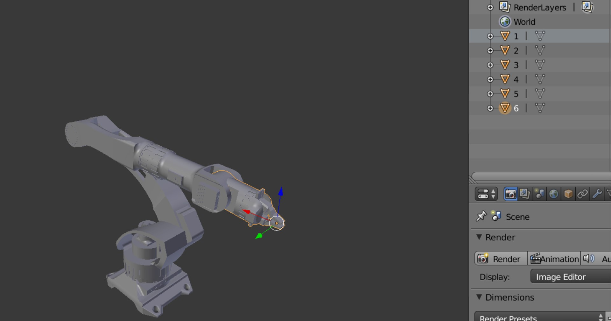
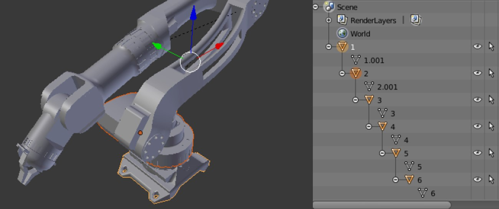
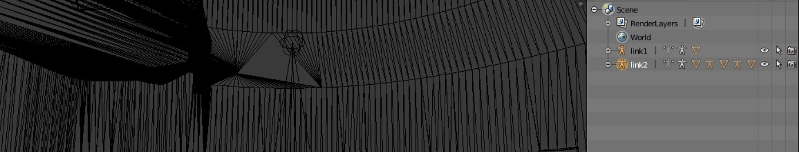
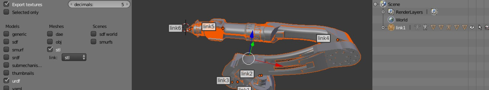

# configuring new arm package on ROS

## Overview:

These tasks is completed by [Nada Oteif](https://sa.linkedin.com/in/nadaoteif) as a part of [Smart Method](https://s-m.com.sa/en/index.html) for Summer training in 2022 at Robotics and AI track.

## Description:

1. I used blender version 2.79 in ubuntu from: https://www.blender.org/download/releases/2-79 to make URDF file.. Then on terminal 

```git clone https://github.com/dfki-ric/phobos.git``` 

to configure phobos which is an add-on for the open-source 3D modeling software Blender that enables the creation of WYSIWYG robot models for use in robot frameworks like ROS. 

2. Installing anaconda from: https://docs.conda.io/projects/conda/en/latest/user-guide/install/linux.html#install-linux-silent 
and create conda environment then complete setup with python 3.5.0


3. Back to blender, 
go to ```file-> User Preferances -> Add-ones -> search for "phobos" and checked Development.Phobos```

After that setting up the model by import .stl files of new arm 



4. Set visual from phobos tab ```general section -> select set phobostype -> visual```

,shapes ```visual/collision section -> Define Geometry -> Mesh```

and hierarchy ```select child then parent holding "shift" starting by the end. Then press left "ctrl + p" to set parent and choose "object"``` 



5. Create links, Make links and parent the part with bone 

Then, Select part and choose "create link" and Make sure selecting the "selected object" from the "create link(s)" options..

Next, make the bone in the correct orientation by pressing "R", 

Then Parent the part and bone by pressing "ctrl + p" part is the child, bone is the parent, choose "bone relative".. 

you should parent all the bones, start from gripper 




6. Set the model name and change phobos object information, Then Create joints and Test it in Pose Mode, After That Create collision and Export URDF



and make some changes to test URDF file..

7. Simulation and Controlling the robot arm by joint_state_publisher

```roslaunch robot_arm_pkg check_motors.launch```
